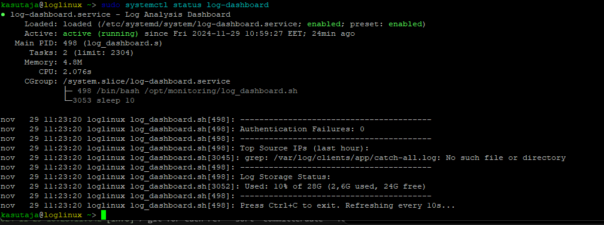

# Lab 01: Linux Logging Implementation
## Student Information
- **Name:** Thorian Perk
- **Repository URL:** (https://github.com/ThorianIT22/monitoring_tperk)
- **Date:** 22.11.2024

## Environment Setup
### VM Configuration
- **VM1 (Log Server)**
  - IP Address: 192.168.5.200/24
  - OS Version: Debian GNU/Linux 12.8
  - Role: Client Server

- **VM2 (Client)**
  - IP Address: 192.168.5.229/24
  - OS Version: Debian GNU/Linux 12.8
  - Role: Logging Server

## Implementation Details
### 1. Security Setup
- [x] Created loguser and loggroup
- [x] Configured proper permissions
- [x] Verified access controls

### 2. Logging Configuration
- [x] Set up rsyslog forwarding
- [x] Configured log rotation
- [x] Implemented audit rules

### 3. Dashboard Implementation
- [x] Created monitoring dashboard
- [x] Implemented real-time analysis
- [-] Added visualization features

## Testing Results
### Security Tests
\`\`\`bash
# Output of permission verification
[Your command output here]
\`\`\`

### Log Generation Tests
\`\`\`bash
# Output showing logs being generated
[Your command output here]
\`\`\`

### Dashboard Output

## Challenges and Solutions
1. [Describe any challenges you faced]
2. [How you solved them]

## Additional Implementations
- [Any extra features you added]
- [Performance improvements]
- [Security enhancements]